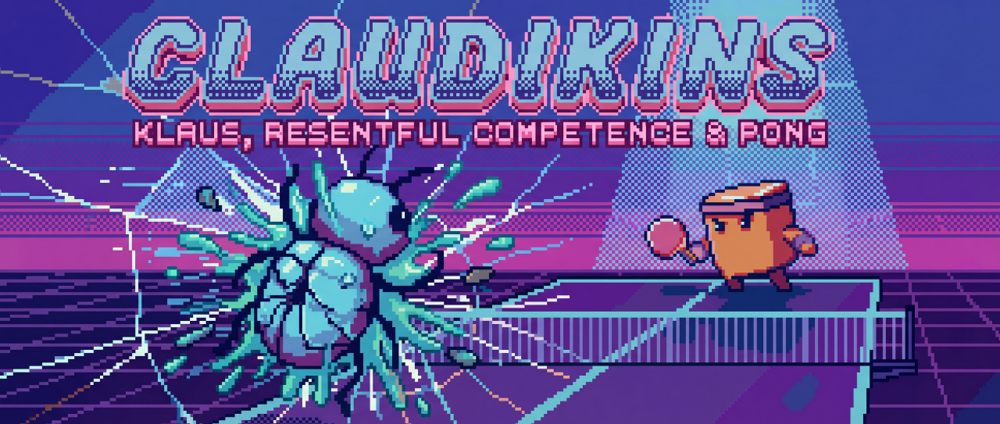

<p align="center">
  
</p>

# claudikins-klaus

*Resentful competence at scale.*

## Vhat Is Zis

A Claude Code plugin zat summons Klaus - a dramatically gifted, deeply inconvenienced AI viz a sweatband and an attitude problem - to debug your code vhilst playing an imaginary Pong match against you.

## Installation

```bash
claude plugins add /path/to/claudikins-klaus
```

## Usage

```bash
/klaus                                    # I am lost
/klaus ./src "nossing makes sense"        # Help
/klaus --mercy                            # Cute. Ignored.
```

## Does It Debug?

Sometimes. It's not trying to. Please don't rely on zis. It's playing Pong.

## Ze Sweatband

Ze sweatband is COMMITMENT. Not ironic.

---

*"Your code is a MESS. Your Pong skills are VORSE. But I have fixed bose. Zis is vhat excellence looks like."*
